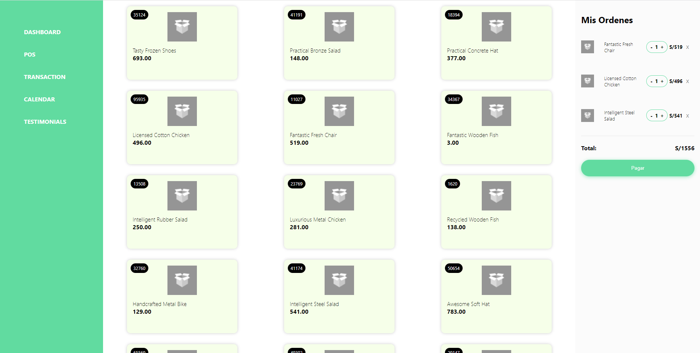

# Proyecto N5NOW

## Prototipo
Link del mockup
https://dribbble.com/shots/8765916-Food-DeliveryPlatform/attachments/987690?mode=media

## Captura final

## Tareas

- [x] Consumo de APIs externas (representada por el json)
- [x] Modularización de Componentes reutilizables
- [x] Conocimientos en CSS y sus distintos pseudo selectores.
- [x] Responsive
- [x] Uso de librerías externas.
- [x] Captura de eventos de elementos html
- [x] Manejo del estado en React por medio de estados globales. (Context, Redux, etc)
- [x] Styled Components
- [ ] Conocimiento en pruebas unitarias
- [x] Conocimiento de build y despliegue en un host.
- [x] Entendimiento de negocio y prevención de casos
- [x] Lista de productos dinamicos
- [x] Link de la aplicación funcionando.

## Tiempo 

El proyecto se desarrollo en 18h.